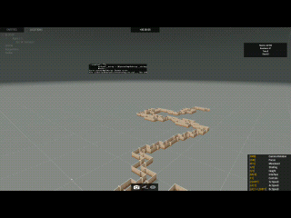

# Arma 3 Random Room Generator

Ein prozeduraler **Room Generator für Arma 3**, der auf vordefinierten **Preset-Räumen** basiert und automatisch einen **Startpunkt** sowie einen **Endpunkt** erzeugt.  
Das System verwendet **Collision Detection**, um Überschneidungen zwischen Räumen zu vermeiden. Falls keine gültige Platzierung mehr möglich ist und die Generation in eine echte Sackgasse läuft, wird der Vorgang **frühzeitig beendet**.

---

---

## Features

- Verwendung von **Preset-Räumen** statt komplett zufälliger Geometrie
- Automatische Generierung eines zusammenhängenden Layouts
- Definierter **Startpunkt**
- **Collision Detection** zur Vermeidung überlappender Räume
- Früher Abbruch bei nicht mehr lösbarer Generationssituation
- Geeignet für:
  - CQB-Trainingsbereiche
  - Roguelike-/Dungeon-artige Missionen

---

## Funktionsweise

Der Generator baut das Layout schrittweise aus einer Sammlung vordefinierter Räume auf.

### Grundprinzip

1. Ein **Start-Raum** wird gesetzt.
2. Von freien Verbindungsstellen aus werden neue Räume aus einem **Preset-Pool** ausgewählt.
3. Vor jeder Platzierung wird geprüft, ob der Raum:
   - korrekt ausgerichtet werden kann
   - mit bestehenden Räumen kollidiert
   - innerhalb der erlaubten Generationslogik liegt
4. Wird ein Raum erfolgreich platziert, wird er dem Layout hinzugefügt.
5. Die Generierung läuft weiter, bis:
   - die gewünschte Anzahl / Tiefe erreicht ist
   - ein gültiger **End-Raum** gesetzt werden kann
   - keine gültige Erweiterung mehr möglich ist

### Collision Detection

Jeder Raum besitzt definierte Begrenzungen, die vor dem Platzieren gegen bereits gesetzte Räume geprüft werden.  
Dadurch werden Überschneidungen und ungültige Platzierungen verhindert.

### Sackgassen-Erkennung / Early Abort

Wenn der Generator trotz mehrerer Versuche keinen weiteren Raum mehr gültig platzieren kann, wird die Generierung **kontrolliert abgebrochen**.  
Das verhindert Endlosschleifen und unnötige Performancekosten.

Ein Abbruch tritt auf, wenn:

- alle verfügbaren Anschlussmöglichkeiten blockiert sind
- kein Preset-Raum mehr kollisionsfrei platziert werden kann
- keine Route mehr in Richtung Endpunkt aufgebaut werden kann

In diesem Fall endet die Generation frühzeitig mit dem bis dahin gültigen Layout.
